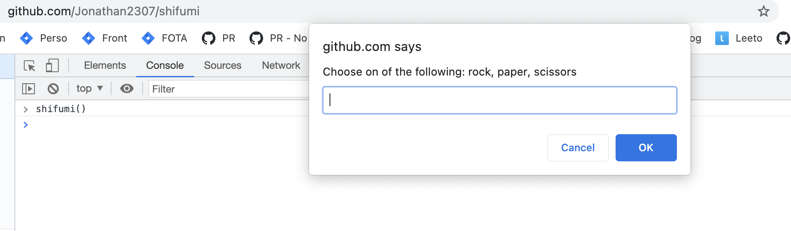
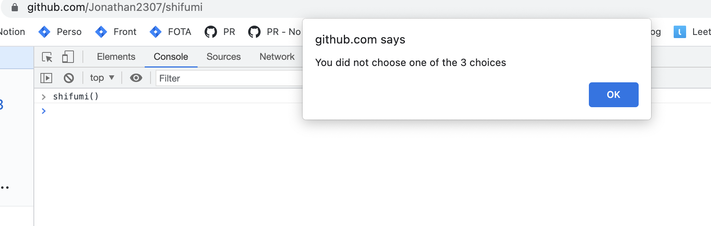
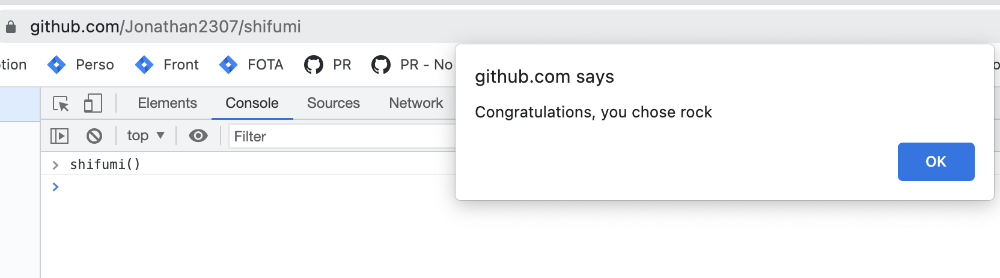

# Shifumi

## Incremental exercise

    
1. Function init

    

    Create a simple Javascript function `shifumi` asking to choose between rock, paper & scissors. If the user did not pick any of the choices, reject it. If the input is correct, print a success message.
    

    
    
    

    
2. Recursivity

    

    Let's consider the error (= the user did not choose one of the right choices) as a user mistake. Let's re-ask the user to choose one of the choices after displaying the error message.
    Bonus: use an early return to manage the errors.
    

3. Generate a random choice from a IA

In order to play the game... you need an opponent right? Then, let's find create a random choice from the script.